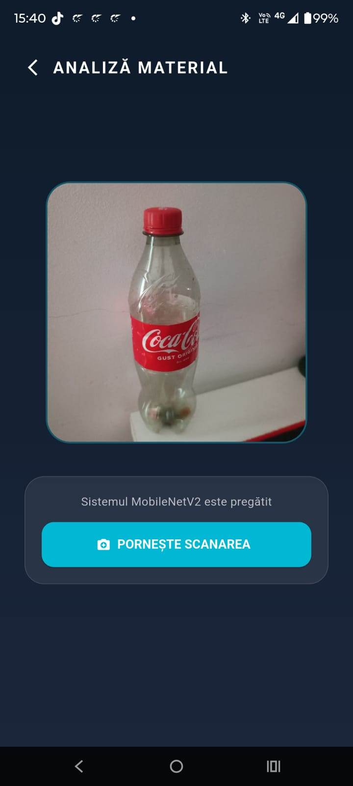
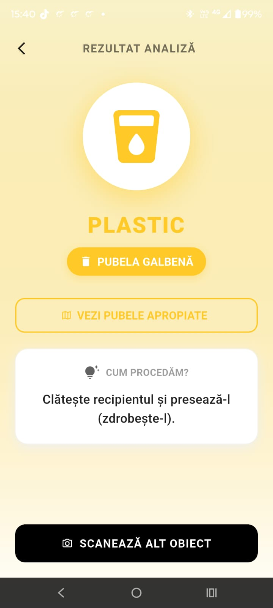
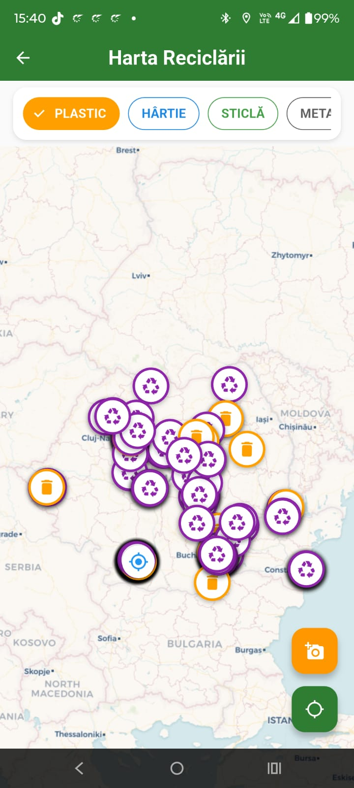

# Harta Ecologica

A Flutter mobile application for **waste classification from images** (using deep learning) and **locating recycling bins on a map** in Romania. Bachelor's thesis project.

## Features

- On-device waste classification from a photo (TensorFlow Lite)
- Map of nearby recycling bins
- Offline map support with tile caching (`dio` + `dio_cache_interceptor`)
- Recommendation of the correct bin for each waste type
- Firebase backend

## Machine Learning Model

12 models were trained and compared on a waste image dataset:

| Architecture | Variants tested |
|---|---|
| CNN Sequential | baseline |
| MobileNetV2 / MobileNetV3 | standard, augmented |
| EfficientNet / EfficientNetV2B0 | standard, augmented |
| InceptionV3 | standard, augmented |
| ResNet50 | standard, augmented |

**Selected for deployment:** MobileNetV2 + data augmentation + fine-tuning, exported as `.tflite`.

| Metric | Value |
|---|---|
| Test accuracy | [98.33%] |
| Macro F1-score | [98.31%] |

Evaluation reports, confusion matrices and accuracy plots are available in the repository root (`*_report.txt`, `confusion_matrix.png`, `acc_comparison.png`, `evolutie_acuratete.png`).

## Project Structure

```
├── lib/            # Flutter application code
├── assets/         # .tflite models, images, labels
├── bin_dataset/    # recycling bin location data
├── training/       # training scripts (Python / Keras)
├── test/           # tests
├── android/ ios/   # mobile platforms
└── *.txt, *.png    # evaluation reports and plots
```

## Getting Started

**Requirements:** Flutter SDK 3.32.5, Android Studio or VS Code, an Android device or emulator.

```bash
git clone https://github.com/Bughi24/HartaEcologica.git
cd HartaEcologica
flutter pub get
```

Create a `.env` file in the project root (do not commit it):

```env
API_KEY=your_key_here
```

Run the app:

```bash
flutter run
```

Build a release APK:

```bash
flutter build apk --release
```

> **Windows:** enable Developer Mode (required for symlink support during the build).

## Training the Models

```bash
cd training
pip install -r requirements.txt
python train.py
```

## Tech Stack

Flutter, Dart, TensorFlow / Keras, TensorFlow Lite, Firebase, flutter_map, Dio

## Screenshots

| Classification | Map | Offline Map |
|---|---|---|
|  |  |  |

## Author

**Calafeteanu Bogdan-Ștefan** - Bachelor's thesis,Faculty of Automation, Computers and Electronics, University of Craiova, 4th year.

## License

Academic project, all rights reserved
